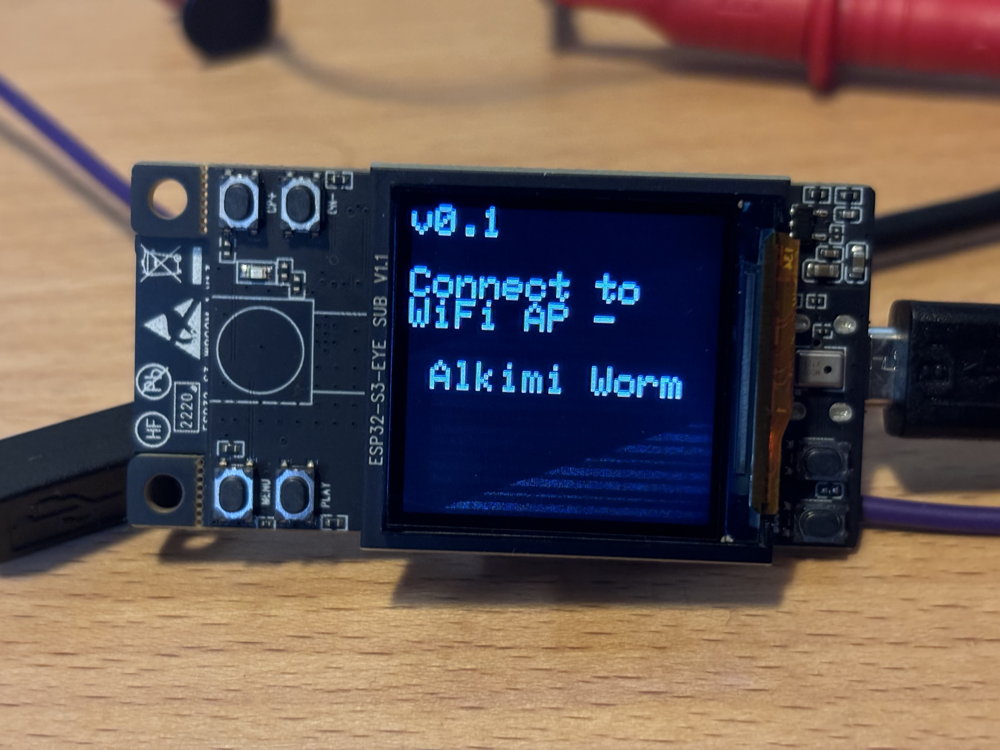
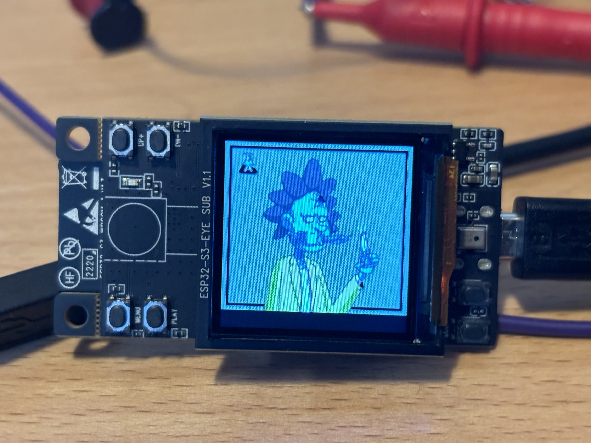
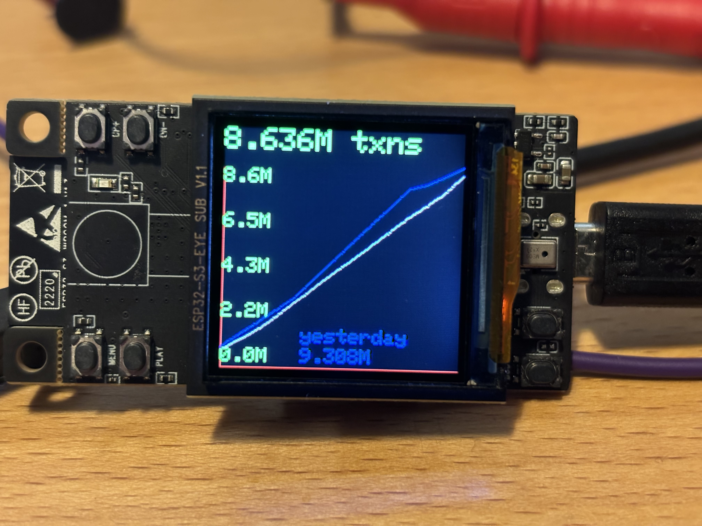
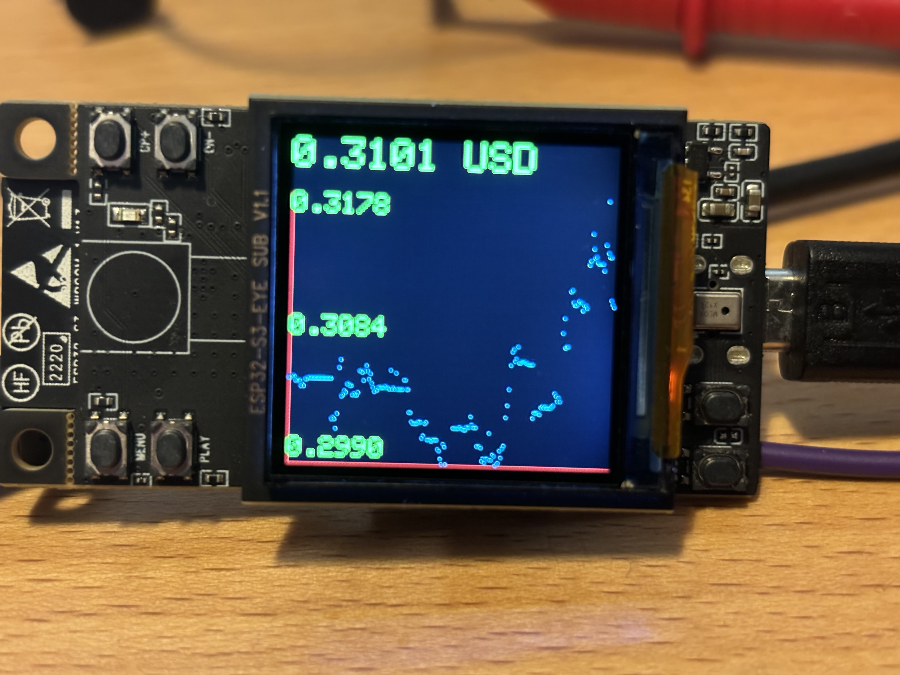
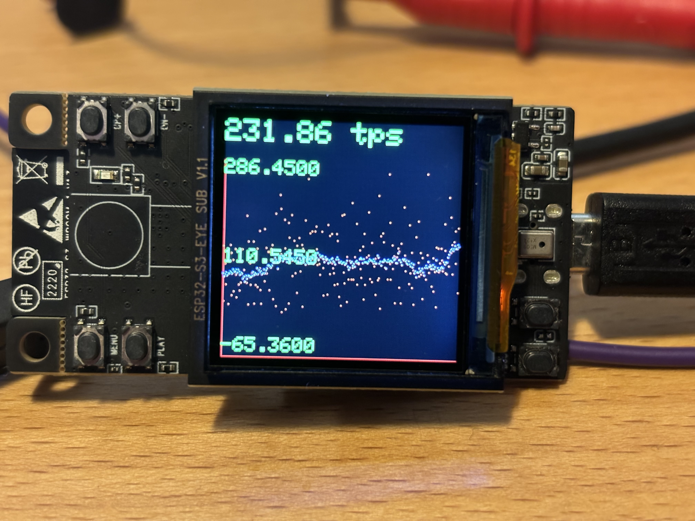

# Acquire esp32-s3-eye

https://www.amazon.com/Espressif-ESP32-S3-EYE-Development-Board/dp/B09MS6PH7L

# Install ESP tool

https://docs.espressif.com/projects/esptool/en/latest/esp32/installation.html

# Flash esp32-s3-eye

## on windows, --port COMx - use device manager to get the COM port number.

```% esptool.py --port COMx write_flash 0x0 alkimi_worm_esp32_v0.1.bin```

Or use the flash download tool at https://www.espressif.com/en/support/download/other-tools

## on mac & linux, -- port /dev/ttyx, you know how to find it. 

```% esptool.py --port /dev/tty.usbmodemxxxxxxx write_flash 0x0 alkimi_worm_esp32_v0.1.bin```

If an error is returned, press and hold boot and reset, let go of reset then boot, try again. 

## Clues for finding COM ports

https://docs.espressif.com/projects/esp-idf/en/v4.3-beta1/esp32/get-started/establish-serial-connection.html

or

https://www.mathworks.com/help/matlab/supportpkg/find-esp32-port-on-windows-mac-and-linux.html

# Provision wifi

* The LCD will indicate you need to connect a smartphone or PC/mac to WIFI AP 'Alkimi Worm'
* Wait for the captive web portal to load a website and scan for WIFI APs
* Select your AP and enter the password at the bottom
* Once the device connects to wifi, Alex and the Worm will appear

# Print a 3d case!

Not my jam, but have at it 

https://www.printables.com/model/933484-esp32-s3-eye-camera-cover-mount?lang=en

https://www.printables.com/model/1081523-prusa-camera-case-with-esp32-s3-eye

# enjoy!







